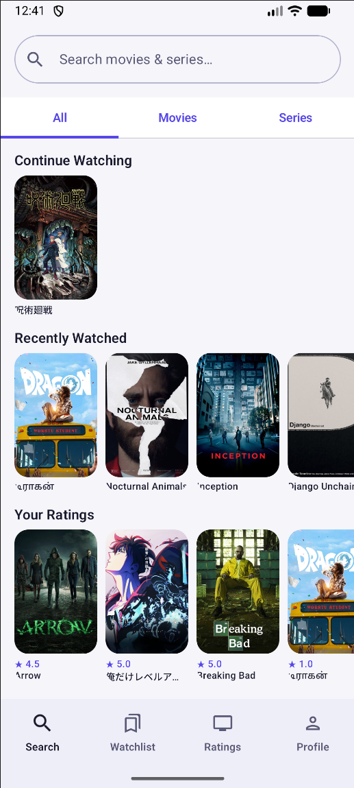
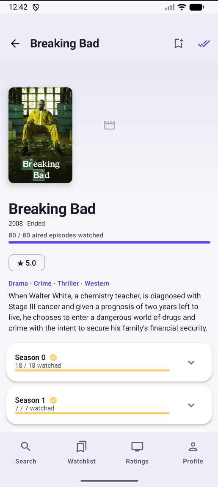
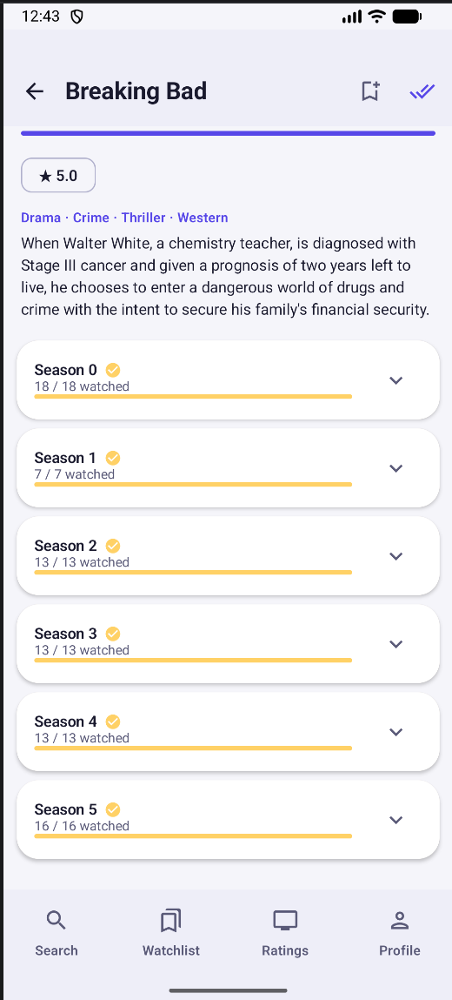
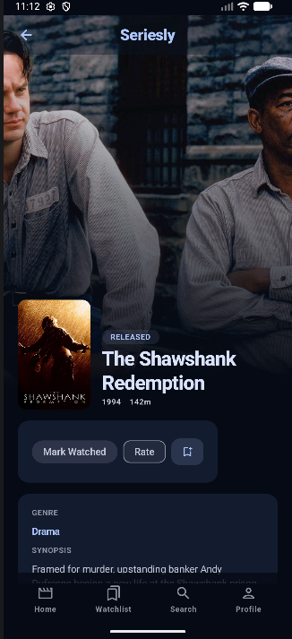
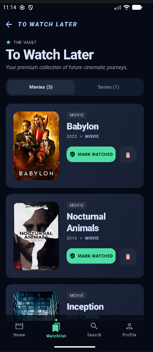
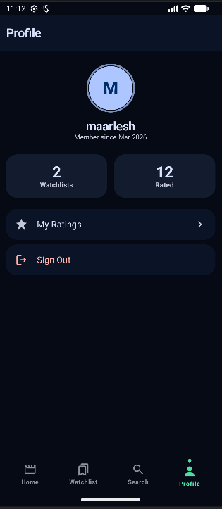

# Seriesly

A polished Android app for discovering, tracking, and rating movies and TV series — built entirely with Jetpack Compose and Material 3, with cloud sync via Firebase Firestore.

---

## Screenshots

| Search & Discover | Series Detail | Episode Tracking |
|:-----------------:|:-------------:|:----------------:|
|  |  |  |

| Movie Detail | Watchlist | Profile |
|:------------:|:---------:|:-------:|
|  |  |  |

---

## Features

- **Search** — Find any movie or TV series powered by the TVDB API, with content type filtering (All / Movies / Series)
- **Discovery** — Home screen surfaces your in-progress series, recently watched movies, your ratings, and watchlists — so you always have something to jump back into
- **Series Tracking** — Expand seasons, mark individual episodes watched, or mark an entire season/series complete in one tap
- **Movie Tracking** — Mark movies as watched with a satisfying animated chip
- **Progress Overview** — Animated progress bar per series shows exactly how far through you are
- **Watchlists** — Create and manage multiple named watchlists; add any movie or series to one or more lists
- **Ratings** — Rate any title out of 5 stars with an optional comment; view all your ratings in one place
- **Cloud Sync** — Watch progress, ratings, and watchlists sync across devices via Firebase Firestore; offline writes are queued and flushed automatically when connectivity returns
- **Celebration Moments** — Particle burst + banner animation when you complete a series
- **Profile** — Animated stats (watchlist count, total ratings) with a count-up effect
- **Offline-first** — Search results and detail pages are cached locally; your watch progress and ratings are stored on-device and synced to the cloud

---

## Tech Stack

| Layer | Technology |
|-------|-----------|
| UI | Jetpack Compose + Material 3 |
| Architecture | MVVM · Unidirectional Data Flow |
| DI | Hilt 2.51 |
| Navigation | Navigation Compose 2.8 |
| Database | Room 2.6 |
| Networking | Retrofit 2.11 + OkHttp 4.12 |
| JSON | Moshi 1.15 |
| Images | Coil 2.7 |
| Cloud Sync | Firebase Firestore (offline-safe, last-write-wins merge) |
| Auth | Firebase Authentication (email/password) |
| Remote Config | Firebase Remote Config (runtime API key delivery) |
| Crash Reporting | Firebase Crashlytics + Analytics |
| Background Work | WorkManager (offline sync queue, cache eviction) |
| Security | AndroidX Security Crypto (EncryptedSharedPreferences) + JBCrypt |
| Async | Kotlin Coroutines + Flow |
| Logging | Timber |
| Testing | JUnit 4 · MockK · Turbine · Google Truth |

---

## Architecture

The project follows a **multi-module clean architecture** with strict separation of concerns:

```
app/
├── core/
│   ├── core-common        # Result types, base classes, extensions
│   ├── core-database      # Room DAOs, entities, AppDatabase
│   ├── core-domain        # Domain models, repository interfaces
│   ├── core-data          # SyncRepository, FirestoreSyncRepository, SyncMerger
│   ├── core-network       # Retrofit, OkHttp, TVDB API service
│   ├── core-ui            # Shared Compose components, Cinematic Obsidian theme
│   └── core-security      # SessionManager, EncryptedPrefs
└── feature/
    ├── feature-auth       # Login & registration screens
    ├── feature-search     # Search + discovery home
    ├── feature-detail     # Series & movie detail screens
    ├── feature-watchlist  # Watchlist list & detail
    ├── feature-progress   # My Ratings screen
    └── feature-profile    # Profile & stats screen
```

Each feature module contains its own `presentation/`, `domain/`, `data/`, `di/`, and `navigation/` packages. Feature modules depend only on `core-*` modules — never on each other.

### Cloud Sync Flow

```
User action
    │
    ▼
Room  ←──────────────── write immediately (offline-safe)
    │
    ▼
SyncRepository
    ├── online  → push delta to Firestore now
    └── offline → enqueue SyncWorker (WorkManager) → flush on reconnect

App launch / sign-in on new device
    ▼
Firestore pull → merge into Room (last-write-wins on updatedAt)
```

Firestore document path: `users/{firebaseUid}/{collection}/{docId}`

---

## Getting Started

### Prerequisites

- Android Studio Hedgehog or newer
- JDK 17
- A free [TVDB API key](https://thetvdb.com/api-information)
- A Firebase project with Firestore, Authentication (Email/Password), Remote Config, and Crashlytics enabled

### Setup

1. **Clone the repo**
   ```bash
   git clone https://github.com/maarlesh/Seriesly.git
   cd Seriesly
   ```

2. **Add your Firebase config**

   Place your `google-services.json` in the `app/` directory (download from Firebase Console → Project settings → Your apps).

3. **Add your TVDB API key to Firebase Remote Config**

   In Firebase Console → Remote Config, create a parameter named `tvdb_api_key` and set its value to your TVDB API key. The app fetches this at runtime — no key is stored in the APK.

4. **(Optional) Local debug key via `local.properties`**

   For local debug builds only, you can add a fallback key:
   ```properties
   TVDB_API_KEY=your_api_key_here
   ```
   This is already in `.gitignore` and ignored in release builds.

5. **Build & run**

   Open the project in Android Studio and run the `app` configuration on a device or emulator running Android 8.0+ (API 26+).

---

## Requirements

- **Min SDK:** Android 8.0 (API 26)
- **Target SDK:** Android 15 (API 35)
- **Language:** Kotlin 2.0
- **Build tools:** AGP 8.5, Gradle with version catalog

---

## Privacy Policy

[https://maarlesh.github.io/Seriesly/privacy-policy](https://maarlesh.github.io/Seriesly/privacy-policy)

---

## License

```
MIT License

Copyright (c) 2025 Seriesly

Permission is hereby granted, free of charge, to any person obtaining a copy
of this software and associated documentation files (the "Software"), to deal
in the Software without restriction, including without limitation the rights
to use, copy, modify, merge, publish, distribute, sublicense, and/or sell
copies of the Software, and to permit persons to whom the Software is
furnished to do so, subject to the following conditions:

The above copyright notice and this permission notice shall be included in all
copies or substantial portions of the Software.

THE SOFTWARE IS PROVIDED "AS IS", WITHOUT WARRANTY OF ANY KIND, EXPRESS OR
IMPLIED, INCLUDING BUT NOT LIMITED TO THE WARRANTIES OF MERCHANTABILITY,
FITNESS FOR A PARTICULAR PURPOSE AND NONINFRINGEMENT. IN NO EVENT SHALL THE
AUTHORS OR COPYRIGHT HOLDERS BE LIABLE FOR ANY CLAIM, DAMAGES OR OTHER
LIABILITY, WHETHER IN AN ACTION OF CONTRACT, TORT OR OTHERWISE, ARISING FROM,
OUT OF OR IN CONNECTION WITH THE SOFTWARE OR THE USE OR OTHER DEALINGS IN THE
SOFTWARE.
```
